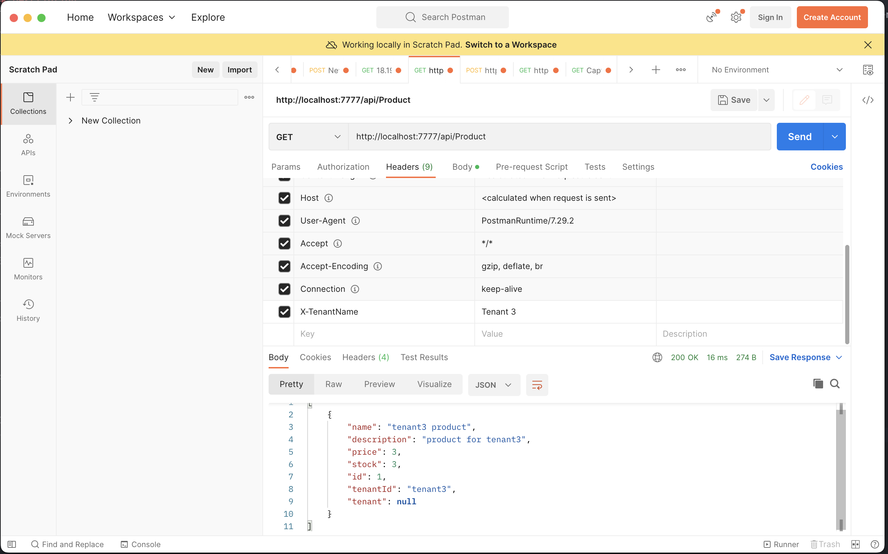

# recordleveltenancy
This repository is created with the sole purpose of learning Multi Tenancy: Shared database with tenant-specific data rows approach.

## Description
This project simulates a web api that has 3 tenants. Tenants share a database and represented with tenantId. The web api is a simple CRUD for a product entity. The web api is implemented with .NET Core 5.

Tenants:
| TenantId 	| Name     	|
|----------	|----------	|
| tenant1  	| Tenant 1 	|
| tenant2  	| Tenant 2 	|
| tenant3  	| Tenant 3 	|

You can clone this project and use docker to try it. To run with docker:
> docker-compose up -d

This will create a mysql container and the web api. Web api will run at port 7777.

For learning purposes there are 3 tenants and requests should be made with "X-TenantName" header.
Example request:

Checkout swagger page for endpoints:
> http://localhost:7777/swagger/index.html